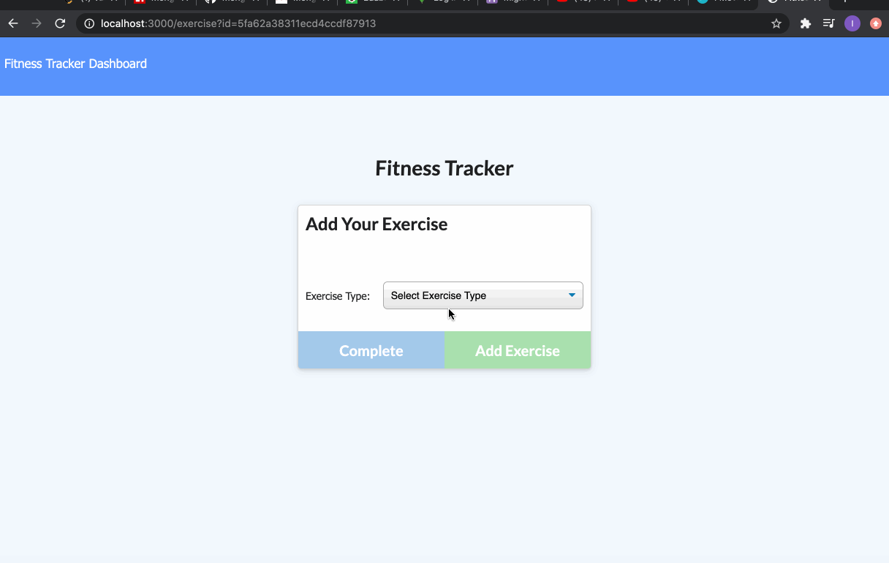

# fitness-traker-itorres# Ivans-Burger-Joint


## Table of Contents
* [Description](#Description)


## Description 
Hi! Welcome to my fitness tracker! This is your friend if you are wanting to track your daily workout. Here you will find the ability to name, type, weight, sets, reps, and duration of exercise. You can log your work outs if it's a type cardio then you are able to log in the distance that you have traveled. Have fun getting more healthy! 


## Technologies
* [JavaScript](https://www.w3schools.com/js/)
* [Mongo](https://www.npmjs.com/package/mongojs)
* [Mongoose](https://mongoosejs.com/docs/validation.html)
* [Morgan](https://www.npmjs.com/package/morgan)
* [Express](https://expressjs.com/)
* [Bootstrap](https://getbootstrap.com/)


## Features


# Code

## Api Routes

* Here are the routes the connect our front end to our data base which in our case we are using mongo. Here I've made routes to post, put (update), and get information form our data base by using mongoose, express and our middleware Router. 
```
const router = require("express").Router();
const { mongo } = require("mongoose");
const Workout = require("../models/workout.js");

router.post("/api/workouts", ({ body }, res) => {
  Workout.create(body)
    .then((dbworkouts) => {
      res.json(dbworkouts);
    })
    .catch((err) => {
      res.status(400).json(err);
    });
});

router.put("/api/workouts/:id", ({ params, body }, res) => {

    Workout.findByIdAndUpdate( params.id, {$push: {exercises: body}})
       .then(function(data) {
           res.send(data)
       })
        
});


router.get("/api/workouts/range", (req, res) => {
  Workout.find()
    .then((dbworkouts) => {
        console.log(dbworkouts);
      res.json(dbworkouts);
    })
    .catch((err) => {
      res.status(400).json(err);
    });
});

router.get("/api/workouts", (req, res) => {
  Workout.find()
    .sort({ day: 1 })
    .then((dbworkouts) => {
      res.json(dbworkouts);
    })
    .catch((err) => {
      res.status(400).json(err);
    });
});

module.exports = router;

  ```

## Models
* Here we see our model. In this case we only have used one model, this is to create a skeleton schema in which to give our database names and rules to follow as we store and recieve information. 

```
let mongoose = require("mongoose");

const Schema = mongoose.Schema;

const workoutSchema = new Schema({
  day: {
    type: Date,
    default: Date.now(),
  },
  exercises: [
    {
      type: {
        type: String,
        required: "Enter a type",
      },
      name: {
        type: String,
        required: "Enter a name",
      },
      duration: {
        type: String,
        required: "Enter a duration",
      },
      weight: Number,
      reps: Number,
      sets: Number,
      distance: Number,
    },
  ],

} ,
{
    toJSON: {
      virtuals: true
    }
  } 

);

workoutSchema.virtual("totalDuration").get(function() {
    return this.exercises.reduce(function (total, exercise) {
        return total + exercise.duration;
      }, 0);
  });

const Workout = mongoose.model("workout", workoutSchema);


module.exports = Workout;


```


## Author
Ivan Torres
* [GitHub-Repo](https://github.com/IvanTorresMia/READme-project-Ivan)
* [linkedIn](www.linkedin.com/in/ivan-torres-0828931b2)
* [Portfolio](https://ivantorresmia.github.io/IvanTorres-portfolio/)
* [Deployed-Link](https://rocky-plateau-91408.herokuapp.com/)

## Credits
* Credits for this homework assignment go out to Jerome, Manuel, Kerwin, Roger, and all of my classmates who helped me in study sessions. As well as my tutor who helped me a ton with understanding this homework assignment. 
* [StackOverFlow](https://stackoverflow.com/)


## License]
[MIT](https://choosealicense.com/licenses/mit/#) license 

